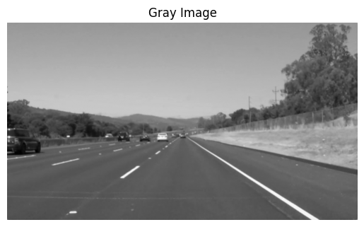
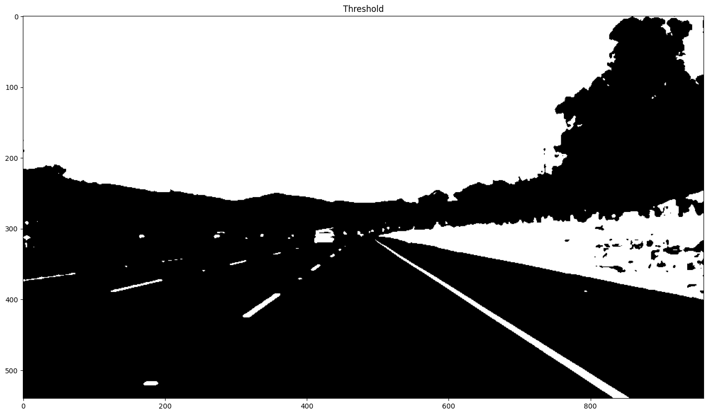
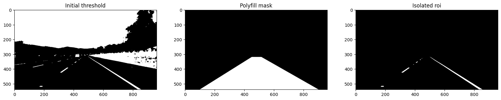
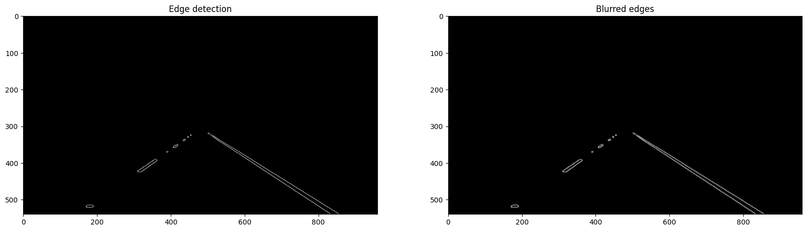
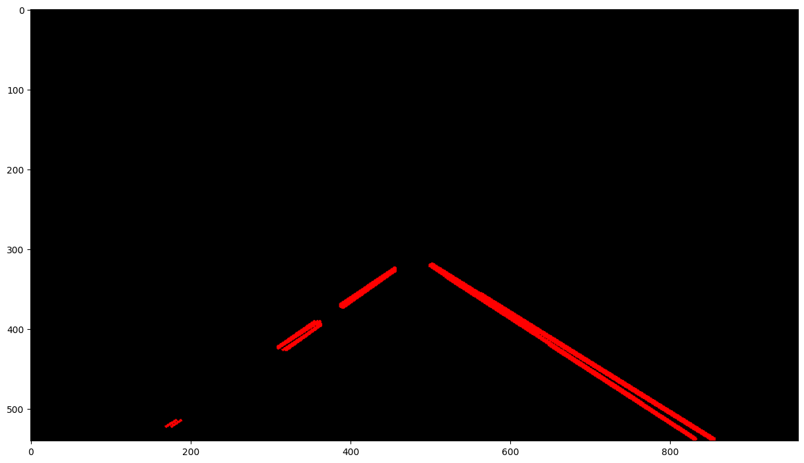

# Edge-Linking-using-Hough-Transform
## Aim:
To write a Python program to detect the lines using Hough Transform.

## Software Required:
Anaconda - Python 3.7

## Algorithm:
### Step1:

Import all the necessary modules for the program.
### Step2:

Load a image using imread() from cv2 module.
### Step3:

Convert the image to grayscale.
### Step4:

Using Canny operator from cv2,detect the edges of the image.
### Step5:

Using the HoughLinesP(),detect line co-ordinates for every points in the images.Using For loop,draw the lines on the found co-ordinates.Display the image.

## Program:

```

Developed By : NAINA MOHAMED Z
Register No. : 212223230131

```
```py

# Import necessary Librares

import cv2
import numpy as np
import matplotlib.pyplot as plt

# Read the image

image = cv2.imread('archery1.jpg')
plt.imshow(cv2.cvtColor(image, cv2.COLOR_BGR2RGB))  
plt.title("Input Image")
plt.axis('off')

# Grayscale image

gray_image = cv2.cvtColor(image, cv2.COLOR_BGR2GRAY)
gray_image = cv2.GaussianBlur(gray_image,(3,3),0)
plt.imshow(gray_image, cmap = 'gray')  
plt.title("Gray Image")
plt.axis('off')

# Use global threshold based on grayscale intensity.

threshold = cv2.inRange(gray_image, 150, 255)

plt.figure(figsize = (20, 10))
plt.subplot(1,1,1); plt.imshow(threshold, cmap = 'gray'); plt.title('Threshold');

#  Region masking: Select vertices according to the input image.
roi_vertices = np.array([[[100, 540], [900, 540], [515, 320], [450, 320]]])

# Defining a blank mask.
mask = np.zeros_like(threshold)   

# Defining a 3 channel or 1 channel color to fill the mask.
if len(threshold.shape) > 2:
    channel_count = threshold.shape[2]  
    ignore_mask_color = (255,) * channel_count
else:
    ignore_mask_color = 255

# Filling pixels inside the polygon.
cv2.fillPoly(mask, roi_vertices, ignore_mask_color)

# Constructing the region of interest based on where mask pixels are nonzero.
roi = cv2.bitwise_and(threshold, mask)

plt.figure(figsize = (20, 10))
plt.subplot(1,3,1); plt.imshow(threshold, cmap = 'gray'); plt.title('Initial threshold')
plt.subplot(1,3,2); plt.imshow(mask, cmap = 'gray'); plt.title('Polyfill mask')
plt.subplot(1,3,3); plt.imshow(roi, cmap = 'gray'); plt.title('Isolated roi');

# Perform Edge Detection.
low_threshold = 50
high_threshold = 100
edges = cv2.Canny(roi, low_threshold, high_threshold)

# Smooth with a Gaussian blur.
kernel_size = 3
canny_blur = cv2.GaussianBlur(edges, (kernel_size, kernel_size), 0)

plt.figure(figsize = (20, 10))
plt.subplot(1,2,1); plt.imshow(edges, cmap = 'gray'); plt.title('Edge detection')
plt.subplot(1,2,2); plt.imshow(canny_blur, cmap = 'gray'); plt.title('Blurred edges');

def draw_lines(img, lines, color = [255, 0, 0], thickness = 2):
    if lines is not None:
        for line in lines:
            for x1,y1,x2,y2 in line:
                cv2.line(img, (x1, y1), (x2, y2), color, thickness)

# Hough transform parameters set according to the input image.
rho = 1
theta = np.pi / 180
threshold = 50
min_line_len = 10
max_line_gap = 20

lines = cv2.HoughLinesP(
    canny_blur, rho, theta, threshold, minLineLength = min_line_len, maxLineGap = max_line_gap)

hough = np.zeros((image.shape[0], image.shape[1], 3), dtype = np.uint8)
draw_lines(hough, lines)

print("Found {} lines, including: {}".format(len(lines), lines[0]))
plt.figure(figsize = (15, 10)); plt.imshow(hough);

```


## Output:

### Input image and grayscale image




### Create Threshold



### Selecting the Region of Interest



### Detect Edges and Smooth Noise




### The result of Hough transform




## Result:

Thus the Lines in the image have been detected using Hough Transform Successfully.
